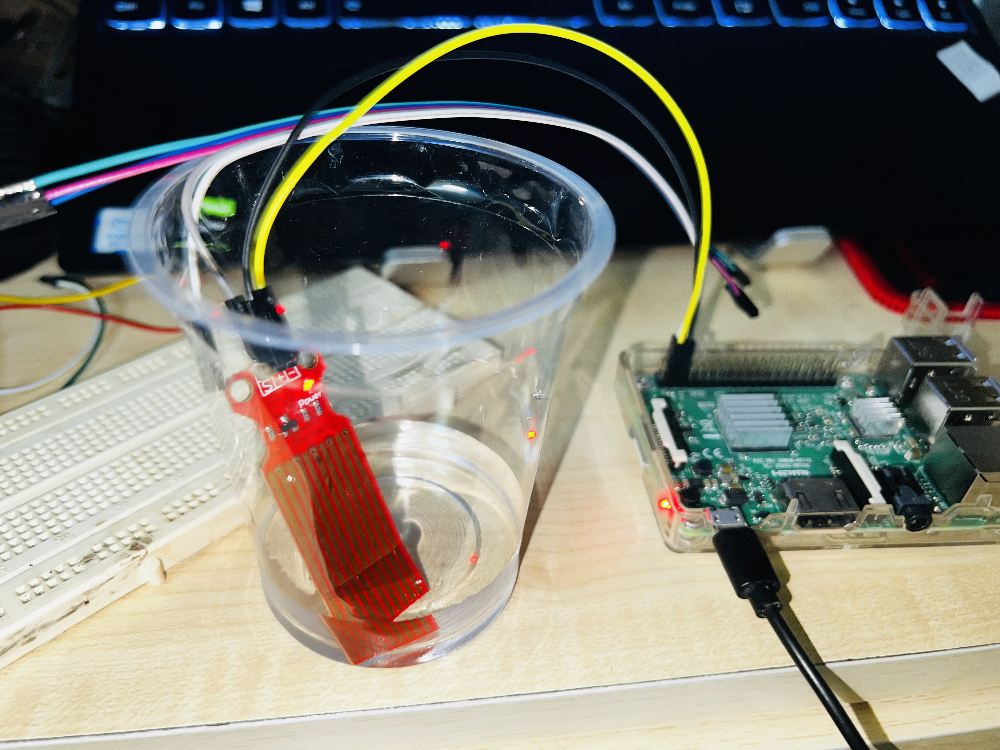

# Contributors

- Gurram Siddarth Reddy - SE20UARI144
- R Souri Satya Saketh  - SE20UARI121
- Neha Tummala - SE20UARI176
- Hemal Tummapudi - SE20UARI063

# Connections
- SEN18 Sensor    Raspberry Pi 4
--------------------------------
    VCC     -->   3.3V
    GND     -->   GND
    DO      -->   GPIO17
# Raspberry Pi Used:


# Sensor Used:
- Robodo SEN18 Water level sensor and depth detection.
- Description:
 Water level sensors are electronic devices designed to measure the level or depth of water in a tank, reservoir, well or other containers. They are commonly used in various applications, including industrial automation, agriculture, environmental monitoring and home automation. The level of water can be an essential parameter in controlling processes, ensuring water availability and preventing overflows or shortages.
- Features and functionalities:
  1. Sensing Technology: Water level sensors can use various sensing technologies, including:

     Ultrasonic Sensors: These sensors use ultrasonic waves to measure the distance to the water's surface and calculate the water level.

     Float Switches: Float switches consist of a buoyant float and a switch. When the float reaches a certain level, it triggers the switch, indicating the water level.

     Capacitive Sensors: Capacitive sensors measure changes in capacitance as the water level changes.

     Pressure Sensors: These sensors measure water pressure, which changes with depth. The pressure reading can be converted into a water level measurement.

  2. Output Interface: Water level sensors typically provide analog or digital output signals. Analog output sensors provide a continuous signal that corresponds to the water level, while digital output sensors provide discrete values (e.g., ON/OFF) based on a predefined threshold.

  3. Accuracy and Resolution: The accuracy and resolution of the sensor determine how precisely it can measure water levels. Higher accuracy sensors are suitable for applications where precise measurements are required.

  4. Material and Enclosure: The material and construction of the sensor are important, especially if it will be exposed to corrosive or harsh environments. Sensors may be housed in waterproof enclosures.

  5. Installation Method: Sensors can be installed at different locations within a container, such as the bottom, side or top, depending on the desired measurement.

   6. Power Supply: Sensors may require a specific power supply voltage, and some may have low power consumption for battery-operated applications.

   7. Calibration: Some sensors may require calibration to provide accurate measurements and they may come with calibration procedures.

    8. Output Communication: In some cases, water level sensors provide communication options allowing integration with microcontrollers or PLCs.

    9. Environmental Factors: Considerations such as temperature range, humidity and resistance to chemicals can be crucial depending on the application.

    10. Display or Data Logging: Some sensors come with built-in displays or data logging capabilities, making it easy to monitor water levels on-site or remotely.


# Our Experiment



# Explaination

- `i2c = board.I2C()` initializes the I2C communication using the board module, which automatically selects the appropriate SDA and SCL pins for your specific board.
- `ads = ADS.ADS1115(i2c)` initializes the Adafruit ADS1115 ADC using the I2C interface. This sets up the ADC for reading analog values.
- `chan = AnalogIn(ads, ADS.P0)` creates an AnalogIn object for channel 0 (AIN0) of the ADC, which represents the water level sensor input.
- `water_level = chan.value` reads the analog value from the water level sensor.

# Execution
Install the required adafruit library using:

``` pip3 install -r requirements.txt ```

To run the code use:

``` python3 main.py```